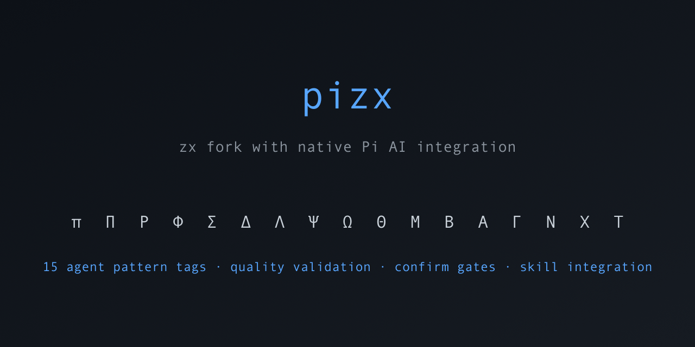

# pizx — zx fork with native Pi AI integration

[](https://www.npmjs.com/package/@topce/pizx)
[](https://github.com/sponsors/topce)



> **AI-powered shell scripting for Node.js** — a [zx](https://github.com/google/zx) fork with native [Pi](https://github.com/earendil-works/pi) AI integration, 16+ agent pattern template tags, contract-first goal execution with cross-model verification, anti-spin loop guards, and multi-agent orchestration. Write shell scripts that can reason, code, collaborate, and self-improve — all from JavaScript/TypeScript.

## Quick Start

```bash
# Step 1: Install Pi CLI (one-time) — needed for AI credentials
# See https://github.com/earendil-works/pi
npm install -g @earendil-works/pi
pi auth login

# Step 2: Install pizx in your project
npm install @topce/pizx
```

Write a script (`hello.mjs`):

```js
#!/usr/bin/env pizx

// Simple AI query
const answer = await π`what is the capital of France?`
echo(answer)

// Agent patterns
const files = await $`ls src/`
const summary = await π`summarize these files in one sentence: ${files}`
console.log(summary)
```

Run it:

```bash
chmod +x hello.mjs
./hello.mjs

# Or:
pizx hello.mjs
```

**New to pizx?** Start with the [Onboarding Guide](docs/onboarding.md).

## Install

```bash
npm install @topce/pizx
```

**Prerequisites:**
- Node.js >= 22.19.0
- [Pi AI CLI](https://github.com/earendil-works/pi) installed and configured with `pi auth login` (provides LLM credentials)

> **No separate install needed for zx.** pizx bundles zx as an npm dependency — `$`, `cd`, `echo`, `fetch`, and all other zx shell commands come built-in when you install `@topce/pizx`.

## Writing Scripts

### Shebang

```js
#!/usr/bin/env pizx

const name = await question('What is your name? ')
const intro = await π`write a friendly greeting for ${name}`
echo(intro)
```

### Programmatic Import

```js
import { $, π, Π, Ρ, Φ, Σ } from '@topce/pizx'

// Greek letters work everywhere...
const output = await $`ls src/ | grep '.ts'`
console.log(output.stdout)

const review = await π`review this code for issues:\n${output.stdout}`
console.log(review.text)

// ...and so do English word aliases:
import { pi, Pi, ralph, fleet, subagent } from '@topce/pizx'

const answer = await pi`explain async/await`
await Pi`fix the TypeScript errors in src/`
await fleet`review all files in src/`
```

> **English word aliases**: Every Greek letter tag has an English alternative.
> `pi` (alias for `π`), `Pi` (alias for `Π`), `fleet` (alias for `Φ`), `ralph` (alias for `Ρ`),
> `pipeline` (alias for `Λ`), etc. — use whichever style you prefer. See [full mapping](#english-aliases) below.

### Global Access (pizx/globals)

Import the `pizx/globals` module to make **all tags and English aliases** available without explicit imports — matching the `#!/usr/bin/env pizx` shebang experience inside scripts loaded via `import()`:

```js
import '@topce/pizx/globals'

// All Greek tags are available without imports:
const answer = await π`explain async/await`
await Π`fix the lint issues`
await Φ`review all files`

// English aliases too:
const docs = await fleet`check all .ts files`
const plan = await orchestrator`design the architecture`

// Helpers:
configurePi({ model: 'anthropic/claude-sonnet-4-5' })
closeAgent()
```

### CLI Quick Queries

```bash
pizx -p "explain async/await in JavaScript"
pizx -p --model deepseek/deepseek-chat "summarize this code: @file.ts"
pizx --version
```

## Tags Reference

Each tag has detailed documentation in [`docs/`](docs/):

### Core

| Tag | Name | Description | Docs |
|---|---|---|---|
| `$` | Shell | Shell commands (unchanged from zx) | — |
| `π` | Pi | AI text generation via pi-ai | [docs/pi.md](docs/pi.md) |
| `Π` | Capital Pi | Pi coding agent with tools (read, bash, edit, write) | [docs/capital-pi.md](docs/capital-pi.md) |

### Agent Patterns (Ρ Φ Σ Δ Λ Ψ Ω Ν γ)

| Tag | Name | Flow | Docs |
|---|---|---|---|
| `Ρ` | Ralph Loop | analyze → plan → execute → review ↺ | [docs/ralph.md](docs/ralph.md) |
| `Φ` | Fleet | A, B, C in parallel → aggregate | [docs/fleet.md](docs/fleet.md) |
| `Σ` | Subagents | decompose → sub-agents → synthesize | [docs/subagent.md](docs/subagent.md) |
| `Δ` | Debate | perspectives → converge | [docs/debate.md](docs/debate.md) |
| `Λ` | Pipeline | stage₁ → stage₂ → stage₃ | [docs/pipeline.md](docs/pipeline.md) |
| `Ψ` | Critique | generate → critique → improve | [docs/critique.md](docs/critique.md) |
| `Ω` | Orchestrator | plan → dispatch → synthesize | [docs/orchestrator.md](docs/orchestrator.md) |
| `Ν` | Nu | analyze → negotiate roles → execute → synthesize | [docs/nu.md](docs/nu.md) |
| `γ` | Goal | contract → execute → verify (separate model) ↺ | [docs/goal.md](docs/goal.md) |

> **New in v0.9.0:** `Ρ` Ralph Loop supports `antiSpin`, `streakMode`, and `budgetCapUsd` guards. `γ` (lowercase gamma) / `goal` provides contract-first execution with a separate verifier model — two different model families must agree before work passes.

### Communication Patterns (Θ Μ Β)

| Tag | Name | Pattern | Docs |
|---|---|---|---|
| `Θ` | Thread | Multi-agent conversation | [docs/thread.md](docs/thread.md) |
| `Μ` | Memory | Shared blackboard | [docs/memory.md](docs/memory.md) |
| `Β` | Broadcast | One-to-many messaging | [docs/broadcast.md](docs/broadcast.md) |

### Orchestration Topologies (Α Γ Χ Τ)

| Tag | Name | Pattern | Docs |
|---|---|---|---|
| `Α` | Adaptive | Self-adjusting workflow | [docs/adaptive.md](docs/adaptive.md) |
| `Γ` | Graph | DAG-based execution | [docs/graph.md](docs/graph.md) |
| `Χ` | Chi | Analyze traces → extract patterns | [docs/chi.md](docs/chi.md) |
| `Τ` | Tau | Define schema → write → refine → consolidate | [docs/tau.md](docs/tau.md) |

### English Aliases

Every Greek letter tag has an equivalent English word. They're interchangeable — use whichever style you prefer.

| Greek | English | Greek | English |
|-------|---------|-------|---------|
| `π` | `pi`, `ai` | `Π` | `Pi`, `codingAgent` |
| `Ρ` | `ralph` | `Φ` | `fleet` |
| `Σ` | `subagent` | `Δ` | `debate` |
| `Λ` | `pipeline` | `Ψ` | `critique` |
| `Ω` | `orchestrator` | `Ν` | `team` |
| `Θ` | `thread` | `Μ` | `memory` |
| `Β` | `broadcast` | `Α` | `adaptive` |
| `Γ` | `graph` | `Χ` | `learn` |
| `Τ` | `store` | `γ` | `goal` |

> **⚠️ `pi` vs `Pi`**: `pi` (lowercase) / `ai` is **text generation** (`π`), `Pi` (capital P) / `codingAgent` is the **coding agent** (`Π`). These are different tags with different capabilities. For unambiguous aliases, use `ai` and `codingAgent`. See [docs/pi.md](docs/pi.md) vs [docs/capital-pi.md](docs/capital-pi.md).

See [`english-examples/`](english-examples/) for runnable examples using all English aliases.

## Architecture

Key design decisions: template-tag DSL with curried option chaining, shared `createPatternTag` factory eliminating boilerplate, `qualityCheck` LLM review, structured `phaseLog` audit trails, `TaskDescriptor` pattern composition, `confirm` human-in-the-loop gates, and `mergeSystem` system prompt propagation. See [`docs/advanced-features.md`](docs/advanced-features.md) for details.

## Advanced Features

### Goal & Loop Guards (v0.9.0)

**`γ` Goal tag** provides contract-first execution with a separate verifier model — the agent writes a formal contract before any work starts, then a DIFFERENT model family verifies output against it. Implements the Clodex pattern from "WTF Is a Loop?" (Matt Van Horn, June 2026): two different model families must agree before work passes.

```js
import { γ, goal } from '@topce/pizx'

const result = await γ({
  verifierModel: 'deepseek/deepseek-v4-pro',   // writes contract + verifies
  workerModel: 'deepseek/deepseek-v4-flash',  // does the work
  maxIterations: 5,
  antiSpin: true,        // detect no-progress and flip-flop
  streakMode: 3,         // require 3 consecutive ALL_PASS
  budgetCapUsd: 5.00,    // don't spend more than $5
})`add error handling to the Fleet pattern`

console.log(result.passed)          // true if contract satisfied
console.log(result.contract)        // the formal contract text
console.log(result.terminationReason)  // why it stopped, if early
```

**Ρ Ralph Loop guards** (anti-spin, streak mode, budget cap) prevent the agent from burning tokens on no-progress iterations:

```js
const result = await Ρ({
  antiSpin: true,       // stop if reviews are >80% identical (no-progress)
  streakMode: 2,        // require 2 consecutive DONE before accepting
  budgetCapUsd: 3.00,   // stop if real cost exceeds $3
})`review and fix issues in src/`

if (result.terminationReason) {
  console.log(`Stopped: ${result.terminationReason}`)  // e.g. "no-progress detected"
}
```

See [docs/goal.md](docs/goal.md), [docs/ralph.md](docs/ralph.md), and the [dogfooding examples](#dogfooding-examples-pizx-builds-pizx).

### Per-Phase Model Selection

All patterns support `plannerModel` and `workerModel` for routing high-level reasoning vs execution to different models:

```js
await Ω({
  plannerModel: 'deepseek/deepseek-v4-pro',  // planning + synthesis
  workerModel: 'deepseek/deepseek-v4-flash',  // worker execution
})`design a notification system`
```

Without per-phase models, patterns fall back to `model` → Pi default.

### System Prompt Propagation

All patterns respect the `system` option. When you provide a custom system prompt, it is prepended to the pattern's default system prompt — your context is never silently discarded:

```js
await Ω({ system: 'You are a senior security architect.' })`design an auth system`
// → "You are a senior security architect.\n\n[PLANNER_SYSTEM]"
```

### Quality Validation

12 patterns support an optional `qualityCheck` flag. When enabled, the pattern runs a post-execution LLM review that scores the final output (0.0–1.0), provides an assessment, and recommends improvements:

Supported by: `Ω` (Orchestrator), `Φ` (Fleet), `Σ` (Subagents), `Δ` (Debate), `Λ` (Pipeline), `Θ` (Thread), `Μ` (Memory), `Β` (Broadcast), `Γ` (Graph), `Ν` (Nu/Team), `Χ` (Chi/Learn), `Τ` (Tau/Store).
Not applicable to: `Ρ` (Ralph Loop — has its own review phase), `Α` (Adaptive), `Ψ` (Critique).

```js
const result = await Ω({ qualityCheck: true })`design the system architecture`

if (result.qualityReview) {
  console.log(`Quality score: ${result.qualityReview.score}`)   // 0.0 – 1.0
  console.log(result.qualityReview.assessment)                   // 1-2 sentence assessment
  console.log(result.qualityReview.recommendation)               // improvement suggestion
}
```

### Human-in-the-Loop (Execution Modes)

Three execution modes control how much human oversight you want:

```js
// auto — no gates, runs to completion (default)
await Ω({ confirm: false })`design the system`
await Ω({ confirm: { auto: true } })`design the system`

// semi — gates at major decision points (backward-compatible with confirm: true)
await Ω({ confirm: true })`design the system`
await Ω({ confirm: { semi: true } })`design the system`
// → "── Confirm (dispatch) ──"
// → "Execute 3 sub-task(s) as planned?"
// → "  1. Analyze requirements"
// → "  2. Design architecture"
// → "  3. Document decisions"
// → "Proceed? [Y/n] "

// hitl — gates before EVERY phase, human approves each step
await Ω({ confirm: { hitl: true } })`design the system`
// → pause at plan, dispatch, AND synthesize
```

Supported by: `π`, `Π`, `Ω`, `Σ`, `Φ`, `Λ`, `Ρ`, `Δ`, `Ψ`.

**Per-pattern gate behavior:**

| Pattern | hitl gates | semi gates |
|---------|-----------|------------|
| `π` / `Π` | before send | before send |
| `Ω` Orchestrator | plan, dispatch, synthesize | plan, dispatch |
| `Σ` Subagents | decompose, execute | decompose |
| `Φ` Fleet | plan, execute | plan |
| `Λ` Pipeline | plan, per-stage | plan (before first stage) |
| `Ρ` Ralph Loop | per-iteration | per-iteration |
| `Δ` Debate | per-round | before first round |
| `Ψ` Critique | generate, review | generate |

> **Note:** `π.stream` does not support `confirm` — streaming has no natural pause point before output. Use non-streaming if you want confirmation.

See [`examples/pattern-execution-modes.mjs`](examples/pattern-execution-modes.mjs) and [`english-examples/execution-modes.mjs`](english-examples/execution-modes.mjs) for full working examples.

### Agent Mode (File Tools for Any Pattern)

By default, all patterns (except `Pi` and `ralph`) use **text generation** — they can read files only if you pass content in via template interpolation. `ralph` already uses coding agent tools when `useTools: true` (default).

Ralph Loop options:

```js
await Ρ({ maxIterations: 3 })`refactor the auth module`        // limit improvement cycles
await Ρ({ useTools: false })`analyze the design`                // text-only mode (no file tools)
await Ρ({ maxAgentTurns: 15 })`implement the feature`           // agent turns per execution phase
```

Set `mode: 'agent'` to give every subtask the same **coding agent tools** as `Pi`:

```js
// Fleet workers can read files
await fleet({ mode: 'agent' })`read package.json and analyze the project`

// Pipeline stages can edit code
await pipeline({ mode: 'agent' })`read src/ and refactor the error handling`

// Orchestrator workers can run commands
await orchestrator({ mode: 'agent' })`check the test coverage and report gaps`

// Debate perspectives can research the codebase
await debate({ mode: 'agent' })`read the architecture docs and debate the design`
```

Available tools: `read`, `bash`, `edit`, `write`, `grep`, `ls`.

Supported by: all patterns (`fleet`, `orchestrator`, `pipeline`, `debate`, `subagent`, `critique`, `thread`, `memory`, `broadcast`, `adaptive`, `graph`, `team`, `learn`, `store`).
Not applicable to: `pi`/`π` (always text), `Pi`/`Π` and `ralph` (already use coding agent).

### Per-Pattern Specific Options

Each pattern accepts options beyond the shared set. Quick reference:

| Pattern | Option | Type | Default | Description |
|---------|--------|------|---------|-------------|
| `Ρ` Ralph | `maxIterations` | number | 5 | Max improvement cycles |
| `Ρ` Ralph | `useTools` | boolean | true | Use coding agent to read/write files |
| `Ρ` Ralph | `maxAgentTurns` | number | 10 | Agent turns per execution phase |
| `Ρ` Ralph | `antiSpin` | boolean | true | Detect no-progress (>80% review overlap) and flip-flop |
| `Ρ` Ralph | `streakMode` | number | 1 | Require N consecutive DONE reviews before stopping |
| `Ρ` Ralph | `budgetCapUsd` | number | — | Stop when real accumulated API cost exceeds this amount |
| `γ` Goal | `verifierModel` | string | planner | Model for contract writing + verification (separate from worker) |
| `γ` Goal | `maxIterations` | number | 5 | Max execution+verify cycles |
| `γ` Goal | `antiSpin` | boolean | true | Detect no-progress and flip-flop patterns |
| `γ` Goal | `streakMode` | number | 1 | Require N consecutive ALL_PASS verdicts |
| `γ` Goal | `budgetCapUsd` | number | — | Stop when real accumulated API cost exceeds this amount |
| `Φ` Fleet | `tasks` | `TaskDescriptor[]` | auto | Explicit task list (supports pattern composition) |
| `Φ` Fleet | `concurrency` | number | 5 | Max parallel workers |
| `Σ` Subagent | `subdomains` | string[] | auto | Explicit sub-task list |
| `Σ` Subagent | `maxSubTasks` | number | 4 | Auto-generated sub-tasks |
| `Σ` Subagent | `concurrency` | number | 4 | Max parallel sub-agents |
| `Δ` Debate | `perspectives` | number | 3 | Number of perspectives |
| `Δ` Debate | `rounds` | number | 1 | Rebuttal rounds (2+ for counter-arguments) |
| `Δ` Debate | `roles` | string[] | auto | Custom perspective roles |
| `Λ` Pipeline | `stages` | `TaskDescriptor[]` | auto | Explicit stage list (supports pattern composition) |
| `Λ` Pipeline | `stagePrompts` | string[] | auto | Per-stage custom prompts |
| `Ψ` Critique | `rounds` | number | 1 | Critique-improve cycles (max 3) |
| `Ω` Orchestrator | `workers` | number | 3 | Sub-task count |
| `Ω` Orchestrator | `concurrency` | number | 3 | Max parallel workers |
| `Θ` Thread | `agents` | number | 3 | Conversation participants |
| `Θ` Thread | `turns` | number | 3 | Speaking turns per agent |
| `Θ` Thread | `roles` | string[] | auto | Custom agent roles |
| `Μ` Memory | `agents` | number | 3 | Blackboard contributors |
| `Μ` Memory | `rounds` | number | 1 | Write rounds (each agent refines after seeing others) |
| `Μ` Memory | `roles` | string[] | auto | Custom contributor roles |
| `Β` Broadcast | `workers` | number | 4 | Recipient agents |
| `Β` Broadcast | `roles` | string[] | auto | Custom specialist roles |
| `Α` Adaptive | `maxSteps` | number | 5 | Max adaptation cycles |
| `Α` Adaptive | `qualityThreshold` | 0.8 | 0.0–1.0 | Early-stop quality level |
| `Γ` Graph | `graph` | `{nodes, edges}` | auto | Explicit DAG definition |
| `Γ` Graph | `separator` | string | `→` | Template parsing separator |
| `Ν` Nu/Team | `minAgents` | number | 2 | Minimum auto-negotiated agents |
| `Ν` Nu/Team | `maxAgents` | number | 5 | Maximum auto-negotiated agents |
| `Ν` Nu/Team | `roles` | `NuRole[]` | auto | Explicit roles (skip negotiation) |
| `Χ` Chi/Learn | `source` | `PatternOutput` | — | Output from another pattern to analyze |
| `Χ` Chi/Learn | `trace` | string | — | Explicit trace text to learn from |
| `Τ` Tau/Store | `agents` | number | 3 | Worker agents |
| `Τ` Tau/Store | `rounds` | number | 1 | Read/write refinement rounds |
| `Τ` Tau/Store | `roles` | string[] | auto | Custom agent roles |

### Option Chaining & Quiet Mode

All tags support option chaining and `.quiet` mode to suppress output:

```js
await π({ model: 'anthropic/claude-sonnet-4-5' })`explain this algorithm`
await Π.quiet`fix the lint issues in src/`
await Φ({ concurrency: 5 })`review all .ts files`
await Σ.quiet`analyze security across the codebase`
await Θ({ agents: 4, turns: 3 })`debate the architecture`
await Γ({ graph: { nodes: [...], edges: [...] } })`execute workflow`
```

### Thinking Level

All tags accept `thinkingLevel` to control reasoning effort on supported models:

```js
await π({ thinkingLevel: 'high' })`solve this complex math problem`
await Ω({ thinkingLevel: 'high' })`design the system architecture`

// Per-phase control (patterns only)
await Φ({ plannerModel: '...', workerModel: '...' })`...`
```

Values: `'off'` | `'minimal'` | `'low'` | `'medium'` (default) | `'high'` | `'xhigh'`.

For token-budget based providers, use `thinkingBudgets` instead (see [Thinking Budgets](#thinking-budgets)).

### Timeout, Retry & API Key

All tags accept `timeoutMs` and `maxRetries` to control LLM call resilience. When unset, the provider SDK defaults apply (typically 10 min timeout, 2 retries).

```js
// Per-pattern
await Φ({ timeoutMs: 30000, maxRetries: 2 })`review all .ts files`

// Per-call on π
await π({ timeoutMs: 15000 })`summarize this document`

// Global defaults
configurePi({ timeoutMs: 60000, maxRetries: 3 })
```

Use `apiKey` to specify a provider API key directly, bypassing environment variable lookup:

```js
await π({ apiKey: 'sk-...' })`analyze this data`
await Ω({ apiKey: 'sk-...' })`design the system`
```

### Concurrency & Workers

Fleet, Orchestrator, and Subagents accept `concurrency` to control parallel execution. Orchestrator and Broadcast accept `workers` to set the number of sub-tasks.

```js
await Φ({ concurrency: 10 })`review all files`            // max 10 parallel
await Ω({ workers: 5, concurrency: 3 })`design the system` // 5 tasks, 3 at a time
await Σ({ maxSubTasks: 6, concurrency: 6 })`analyze`       // 6 sub-tasks, all parallel
```

Defaults: concurrency = 5 (Fleet), 3 (Orchestrator), 4 (Subagents). Workers: 3 (Orchestrator), 4 (Broadcast).

### Streaming (π.stream)

For real-time streaming, use `π.stream` as an async generator:

```js
for await (const chunk of π.stream`tell me a long story`) {
  process.stdout.write(chunk)
}
```

### Token, Cost & Phase Tracking

Every pattern output and π call includes an execution trace with token usage, cost, and a structured phase log. All collected automatically — no extra flags needed.

```js
const result = await Ω`design a notification system`

// Per-call breakdown
for (const t of result.trace) {
  console.log(`Call ${t.call}: ${t.modelId} — ${t.totalTokens} tokens, $${t.cost.toFixed(6)}`)
}

// Aggregates (on both PatternOutput and PiOutput)
console.log(`Total: ${result.totalTokens} tokens`)
console.log(`Cost:  $${result.totalCost.toFixed(4)}`)
console.log(`Calls: ${result.callCount}`)

// Structured phase log — what happened during execution
for (const phase of result.phaseLog) {
  console.log(`${phase.phase}: ${phase.durationMs}ms — ${phase.description}`)
}
// → "plan: 1234ms — Generated plan with 3 workers"
// → "dispatch: 5678ms — Executed 3 worker(s), 3 succeeded"
// → "synthesize: 901ms — Synthesized worker results"

// Works with π too
const answer = await π`explain quantum computing`
console.log(`Input: ${answer.inputTokens}, Output: ${answer.outputTokens}`)
console.log(`Cost:  $${answer.totalCost.toFixed(6)}`)
```

Each `CallTrace` entry includes: call index, model id, prompt/output previews, input/output/cache tokens, cost (USD), and duration.

### Shared Type System

All pizx tags return objects implementing `TagOutput` — the common contract for `text`, `duration`, and coercion methods (`toString()`, `valueOf()`).

| Type | Description |
|------|-------------|
| `TagOutput` | Base interface for all tag results (`PiOutput`, `AgentOutput`, `PatternOutput`). Provides `text`, `startTime`, `endTime`, `duration`. |
| `PiOutput` | Returned by `π` / `pi`. Includes `trace`, `inputTokens`, `outputTokens`, `totalTokens`, `totalCost`. |
| `AgentOutput` | Returned by `Π` / `Pi` / `codingAgent`. Includes `turnCount`. |
| `PatternOutput` | Base for all pattern results. Includes `trace`, `phaseLog`, `inputTokens`, `outputTokens`, `totalTokens`, `totalCost`, `callCount`. |
| `WorkerResult` | Shared shape for sub-task results (`FleetMemberOutput`, `OrchestratorWorkerResult`, `SubagentResult`). Provides `task`, `text`, `output`, `success`, `error`. |

```js
import { type TagOutput, type WorkerResult } from '@topce/pizx'

function handleResult(result: TagOutput) {
  console.log(result.text)
  console.log(`Took ${result.duration}ms`)
}
```

### Pattern Composition (Nesting)

Fleet and Pipeline accept `TaskDescriptor` — either a plain string (for a standard LLM call) or a function that invokes another pattern as a sub-task. See [docs/advanced-features.md](docs/advanced-features.md#pattern-composition-taskdescriptor) for details.

**Fleet with mixed tasks:**

```js
await Φ({
  tasks: [
    'analyze the frontend',              // string: standard LLM call
    () => Σ\`analyze the backend\`,       // function: compose a Subagents pattern
    () => Ψ\`review the API design\`,     // function: compose a Critique pattern
  ],
})`review everything`
```

**Pipeline with composed stages:**

```js
await Λ({
  stages: [
    'generate product description',       // string: standard LLM call
    (prev) => Ψ\`critique this: ${prev}\`, // function: receives previous output
  ],
})`generate → improve`
```

### Global Configuration

```js
import { configurePi, configureAgent } from '@topce/pizx'

configurePi({ model: 'anthropic/claude-sonnet-4-5', maxTokens: 8000, timeoutMs: 60000 })
configureAgent({ maxTurns: 5, excludeTools: ['write'] })
```

### Capital Pi (Π) Agent Options

`Π` / `Pi` accepts options to control the coding agent session:

```js
// Agent tools: read, bash, edit, write, grep, ls
await Π({ tools: ['read', 'bash'] })`read-only analysis`          // restrict available tools
await Π({ excludeTools: ['write'] })`review and suggest fixes`     // exclude specific tools
await Π({ cwd: '/path/to/project' })`refactor this module`         // working directory
await Π({ maxTurns: 5 })`quick fix`                                // limit agent turns
await Π({ skills: ['code-simplification'] })`clean up this code`   // load skills
await Π({ system: 'You are a security auditor' })`audit the auth`  // custom system prompt

// Session management
import { closeAgent } from '@topce/pizx'
await closeAgent()  // dispose shared Π session (resets state between scripts/tests)
```

### System Prompt Overrides

All tags accept `system` (replaces default) and `appendSystemPrompt` (appended after system).

```js
// π: custom system prompt
await π({ system: 'You are a security auditor' })`review this code`

// π: with appendSystemPrompt
await π({ appendSystemPrompt: 'Respond in JSON format' })`list all .ts files`

// Π: set system prompt and append extra instructions
await Π({ system: 'You are a test engineer', appendSystemPrompt: 'Write tests first' })`add tests for auth`

// Patterns: inject system context via mergeSystem
await Ω({ system: 'Prioritize security over performance' })`design login flow`
```

### Thinking Budgets

Fine-grained token budgets per reasoning level. Passes through to providers via `thinkingBudgets`.

```js
// Per-call
await π({ thinkingBudgets: { medium: 16384, high: 65536 } })`analyze`

// Global default
configurePi({ thinkingBudgets: { medium: 20480, high: 131072 } })

// Patterns support it too
await Ω({ thinkingBudgets: { high: 65536 } })`deep analysis task`
```

### Skill Integration

Load Pi agent skills from disk and inject them as system context. Skills are discovered from the same paths as `skill.sh`: `.pi/skills`, `.agents/skills`, `~/.pi/agent/skills`, etc.

```js
import { loadSkillContent, loadSkillContents } from '@topce/pizx'

// Load a single skill
const codeStyle = await loadSkillContent('code-simplification')
if (codeStyle) {
  await π({ system: codeStyle })`refactor auth.ts`
}

// Load multiple skills
const skills = await loadSkillContents(['test-driven-development', 'spec-driven-development'])

// Π accepts skills option — loads and registers skill directories
await Π({ skills: ['code-simplification'] })`clean up this file`

// All patterns accept skills option — injects skills as system context
await Ω({ skills: ['spec-driven-development', 'incremental-implementation'] })`build the feature`
await Φ({ skills: ['test-driven-development'] })`review and add tests`
```

#### Shell Skill Helper

Use `skill.sh` in shell/pizx scripts for quick skill-powered queries without JavaScript:

```bash
source ./node_modules/@topce/pizx/src/skill.sh
pizx_use_skill code-simplification "refactor the main module"
pizx_list_skills  # show all available skills
```

See [`src/skill.sh`](src/skill.sh) for details.

## CLI Reference

```bash
pizx [options] <script>      # Run a pizx script
pizx -p <prompt>              # Quick pi-ai query
pizx --version                # Print version
pizx --help                   # Print help
```

**Options:**
- `-p, --prompt <text>` — Run a quick pi-ai query (no script needed)
- `-m, --model <id>` — Specify AI model to use
- `-q, --quiet` — Suppress status output
- `--system <text>` — System context for pi-ai (print mode only)
- `-v, --version` — Print version (pizx / zx / node)
- `-h, --help` — Print CLI help with all tag reference

## Commands

```bash
npm run build                  # Build (JS + DTS)
npm run check                  # Format with Biome
npm run lint                   # Lint (Biome + ESLint)
npm test                       # 363 unit tests (no network)
npm run test:integration       # Integration tests (requires Pi credentials)
npm run test:quality           # Run qualityCheck example
npm run test:confirm           # Run confirm gate example
npm run test:composition-fleet # Run pattern composition in Fleet example
npm run test:composition-pipeline # Run pattern composition in Pipeline example
npm run test:new-features      # Run all 4 feature examples
npm run example:hello          # Run hello example
npm run example:all            # Run all pattern examples
```

## Examples

See [`examples/`](examples/) for runnable examples of every pattern and feature:

### Pattern Examples

- [`hello-pizx.mjs`](examples/hello-pizx.mjs) — Basic script with shell + AI
- [`basic-pi.mjs`](examples/basic-pi.mjs) — π text generation
- [`basic-capital-pi.mjs`](examples/basic-capital-pi.mjs) — Π coding agent
- [`quick-ask.mjs`](examples/quick-ask.mjs) — Quick π query
- [`ralph-loop.mjs`](examples/ralph-loop.mjs) — Ralph Loop (detailed)
- [`pattern-ralph.mjs`](examples/pattern-ralph.mjs) — Ralph Loop (concise)
- [`pattern-fleet.mjs`](examples/pattern-fleet.mjs) — Fleet parallel execution
- [`pattern-subagent.mjs`](examples/pattern-subagent.mjs) — Subagents delegation
- [`pattern-debate.mjs`](examples/pattern-debate.mjs) — Multi-perspective debate
- [`pattern-orchestrator.mjs`](examples/pattern-orchestrator.mjs) — Orchestrator
- [`pattern-pipeline.mjs`](examples/pattern-pipeline.mjs) — Pipeline chain
- [`pattern-critique.mjs`](examples/pattern-critique.mjs) — Critique loop
- [`pattern-thread.mjs`](examples/pattern-thread.mjs) — Thread conversation
- [`pattern-memory.mjs`](examples/pattern-memory.mjs) — Memory blackboard
- [`pattern-broadcast.mjs`](examples/pattern-broadcast.mjs) — Broadcast messaging
- [`pattern-adaptive.mjs`](examples/pattern-adaptive.mjs) — Adaptive workflow
- [`pattern-graph.mjs`](examples/pattern-graph.mjs) — DAG execution
- [`pattern-nu.mjs`](examples/pattern-nu.mjs) — Self-organizing teams
- [`pattern-chi.mjs`](examples/pattern-chi.mjs) — Cross-agent learning
- [`pattern-tau.mjs`](examples/pattern-tau.mjs) — Tool-mediated store
- [`pattern-five-whys.mjs`](examples/pattern-five-whys.mjs) — Five Whys analysis
- [`pattern-agent-with-skill.mjs`](examples/pattern-agent-with-skill.mjs) — Using loaded skills with patterns
- [`pattern-tracking.mjs`](examples/pattern-tracking.mjs) — Token/cost tracking
- [`pattern-quality.mjs`](examples/pattern-quality.mjs) — Quality check demo
- [`pattern-timeout-retry.mjs`](examples/pattern-timeout-retry.mjs) — Timeout & retry demo
- [`pattern-system-propagation.mjs`](examples/pattern-system-propagation.mjs) — System prompt propagation

### Workflow Composition Examples

- [`pattern-workflow-goal-contract.mjs`](examples/pattern-workflow-goal-contract.mjs) — π contract → Σ decompose → Ψ verify
- [`pattern-workflow-build-test-fix.mjs`](examples/pattern-workflow-build-test-fix.mjs) — Builder + Verifier pair loop
- [`pattern-workflow-adversarial-cross-model.mjs`](examples/pattern-workflow-adversarial-cross-model.mjs) — Two model families cross-verify
- [`pattern-workflow-adversarial-verification.mjs`](examples/pattern-workflow-adversarial-verification.mjs) — Worker → Verifiers pattern
- [`pattern-workflow-classify-act.mjs`](examples/pattern-workflow-classify-act.mjs) — Classify-and-route pattern
- [`pattern-workflow-generate-filter.mjs`](examples/pattern-workflow-generate-filter.mjs) — Generate → Score → Filter
- [`pattern-workflow-fanout-synthesize.mjs`](examples/pattern-workflow-fanout-synthesize.mjs) — Fan-out → Synthesize
- [`pattern-workflow-loop-until-done.mjs`](examples/pattern-workflow-loop-until-done.mjs) — Loop with quality gates
- [`pattern-loop-engineering.mjs`](examples/pattern-loop-engineering.mjs) — Full loop engineering: triage → isolate → fix → verify → state persistence
- [`pattern-workflow-tournament.mjs`](examples/pattern-workflow-tournament.mjs) — Bracket tournament selection

### Dogfooding Examples (pizx builds pizx)

- [`pattern-dogfood-goal.mjs`](examples/pattern-dogfood-goal.mjs) — γ Goal audits pizx docs
- [`pattern-dogfood-ralph-guards.mjs`](examples/pattern-dogfood-ralph-guards.mjs) — Ρ with antiSpin + streak + budget on src/
- [`pattern-dogfood-cross-model.mjs`](examples/pattern-dogfood-cross-model.mjs) — Claude vs DeepSeek cross-verify pizx architecture

### English Aliases Examples

See [`english-examples/`](english-examples/) for runnable examples using all English aliases:

- [`hello.mjs`](english-examples/hello.mjs) — Hello world with English aliases
- [`fleet.mjs`](english-examples/fleet.mjs) — Fleet via English aliases
- [`debate.mjs`](english-examples/debate.mjs) — Debate via English aliases
- [`orchestrator.mjs`](english-examples/orchestrator.mjs) — Orchestrator via English aliases
- [`pipeline.mjs`](english-examples/pipeline.mjs) — Pipeline via English aliases
- [`goal.mjs`](english-examples/goal.mjs) — Goal with antiSpin + streakMode + budgetCapUsd
- [`ralph-guards.mjs`](english-examples/ralph-guards.mjs) — Ralph with all 3 new guards
- [`all-patterns.mjs`](english-examples/all-patterns.mjs) — All patterns via English aliases
- [`import-verify.mjs`](english-examples/import-verify.mjs) — Verify all imports
- [`execution-modes.mjs`](english-examples/execution-modes.mjs) — hitl/semi/auto modes via English aliases

### New Feature Demos

- [`test-quality.mjs`](examples/test-quality.mjs) — `qualityCheck` + `system` + `phaseLog`
- [`test-confirm.mjs`](examples/test-confirm.mjs) — Human-in-the-loop approval gate
- [`pattern-execution-modes.mjs`](examples/pattern-execution-modes.mjs) — hitl/semi/auto execution modes (9 patterns × 3 modes)
- [`test-composition-fleet.mjs`](examples/test-composition-fleet.mjs) — Pattern composition in Fleet
- [`test-composition-pipeline.mjs`](examples/test-composition-pipeline.mjs) — Pattern composition in Pipeline

## License

MIT

## Credits

Built on the shoulders of two outstanding tools:

- [**zx**](https://github.com/google/zx) by [Anton Medvedev](https://github.com/antonmedv) — the original shell scripting tool for Node.js that popularized template-tag ergonomics for command execution. pizx preserves every zx API (`$`, `cd`, `echo`, `fetch`, `chalk`, etc.) unchanged.
- [**Pi**](https://github.com/earendil-works/pi) by [Mario Zechner](https://github.com/badlogic) / Earendil Works — the unified LLM API and coding agent harness that powers all `π`, `Π`, and pattern tags through `@earendil-works/pi-ai` and `@earendil-works/pi-coding-agent`.
