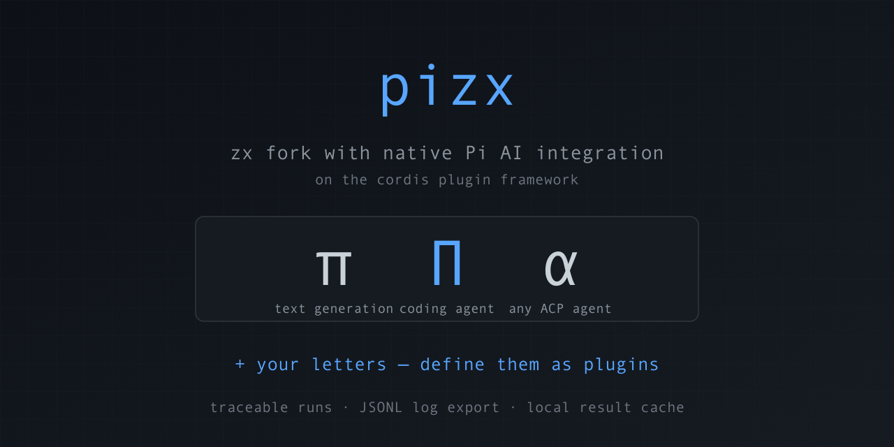

# pizx — zx fork with native Pi AI integration, on cordis

[](https://www.npmjs.com/package/@topce/pizx)
[](https://github.com/sponsors/topce)



> **AI-powered shell scripting for Node.js** — a [zx](https://github.com/google/zx) fork with native [Pi](https://github.com/earendil-works/pi) AI integration, built on the [cordis](https://github.com/cordiverse/cordis) plugin framework. Three letters ship in core — **π** (text generation), **Π** (coding agent), and **α** (any ACP-compatible agent) — and you define your own letters as plugins. Every run is traceable and exportable as JSONL, and cacheable letters hit a local result cache.

```js
#!/usr/bin/env pizx

const answer = await π`what is the capital of France?`
echo(answer)

await Π`fix the TypeScript errors in src/`
```

## Quick Start

```bash
# Step 1: Install Pi CLI (one-time) — needed for AI credentials
npm install -g @earendil-works/pi
pi auth login

# Step 2: Install pizx in your project
npm install @topce/pizx
```

Write a script (`hello.mjs`):

```js
#!/usr/bin/env pizx

// Simple AI query
const answer = await π`what is the capital of France?`
echo(answer)

// Shell + AI, zx-style
const files = await $`ls src/`
const summary = await π`summarize these files in one sentence: ${files}`
console.log(summary)
```

Run it:

```bash
chmod +x hello.mjs
./hello.mjs          # or: pizx hello.mjs
```

**Prerequisites:** Node.js >= 22.19.0, [Pi AI CLI](https://github.com/earendil-works/pi) configured with `pi auth login`.
**No separate zx install needed** — pizx bundles zx; `$`, `cd`, `echo`, `fetch` and friends come built-in.

## The letters

| Letter | What it does |
|---|---|
| `π` (`pi`, `ai`) | Pi AI text generation — ask a model anything, stream it, cache it |
| `Π` (`Pi`, `piAgent`, `codingAgent`) | Pi coding agent with tools (read, bash, edit, write, grep, …) |
| `α` (`acp`, `agent`) | Any ACP-compatible coding agent (server required — no pi needed) |

```js
const answer = await π({ model: 'anthropic/claude-sonnet-4-5' })`explain async/await`
const json = await π.quiet()`generate a JSON array of 5 colors`
for await (const chunk of π.stream`tell me a story`) process.stdout.write(chunk)

await Π({ tools: ['read', 'bash', 'edit'] })`refactor the auth module`

// α speaks the generic Agent Client Protocol — any ACP v1 server works:
await α({ server: ['kiro-cli', 'acp'] })`fix the TypeScript errors in src/`
```

All three return a `LetterOutput`: `text`, `modelId` (alias `modelUsed`),
`isFromCache` (alias `fromCache`), timing, and token/cost getters — plus
`output.trace` with the LLM calls of that invocation. Full option tables:
[π](docs/pi.md), [Π](docs/capital-pi.md),
[α](docs/acp.md). α is independent of pi entirely: install the agent CLI you
want (e.g. [Kiro](https://kiro.dev/docs/cli/acp/)) and pass its command.

## Define your own letters

pizx is a plugin host. A letter is a cordis plugin that registers a template
tag — full guide in [docs/extension.md](docs/extension.md):

```js
// plugins/summarize.mjs
import Schema from 'schemastery'

export const name = 'summarize'
export const inject = ['letters', 'llm']

export function apply(ctx) {
  ctx.letters.define('Σ', {
    aliases: ['summarize'],
    options: Schema.object({ maxWords: Schema.natural().default(30), model: Schema.string() }),
    run: async (prompt, opts, { ctx }) => {
      const result = await ctx.llm.ask(
        `Summarize in at most ${opts.maxWords} words:\n\n${prompt}`,
        { model: opts.model }
      )
      return result.text
    },
  })
}

export default { name, inject, apply }
```

```js
// pizx.config.mjs — next to your script (loaded automatically)
import summarize from './plugins/summarize.mjs'
export const plugins = [summarize]
```

```js
#!/usr/bin/env pizx
const summary = await Σ({ maxWords: 20 })`pizx is…`
```

Your letters get the full built-in DX automatically: option chaining,
`.quiet` / `.cache` variants, `.stream` support, tracing, caching, and
globals injection (`pizx --letters` lists them). Collisions are errors,
unloading a plugin removes its letters (cordis effects), and `inject`
dependencies make load order irrelevant.

## Words — composable AI patterns

**Words** are named AI patterns built by composing letters; a word is itself
a letter, so words compose recursively. Seven ship as ready-made plugins in
[examples/plugins/](examples/plugins/) — the patterns from Anthropic's
[Building effective agents](https://www.anthropic.com/engineering/building-effective-agents)
— and load through `pizx.config.mjs` like any plugin:

| Word | Aliases | Pattern |
|---|---|---|
| `ralph` | `loop` | Agent loop — iterative analyze/plan/execute/review |
| `fleet` | `parallel` | Parallelization: sectioning — split prompt, fan out |
| `chain` | `pipeline` | Prompt chaining — sequential steps + optional gate |
| `route` | `branch` | Routing — classify, then dispatch |
| `vote` | `jury` | Voting — N parallel answers, tallied |
| `refine` | `optimize` | Evaluator-optimizer — revise against criteria until PASS |
| `orchestrate` | `director` | Orchestrator-workers — decompose, fan out, synthesize |

```js
await chain({ steps: ['outline', 'π'] })`write a document about X`
await route({ routes: { refund: 'π', tech: 'Π' } })`support query`
await vote({ votes: 5 })`is this diff safe to merge?`
await refine({ criteria: 'no jargon, under 50 words' })`explain monads`
await orchestrate`audit the docs for inconsistencies`
```

Every word's letters live in replaceable **slots** — `ralph({ execute: 'α' })`,
`fleet({ worker: 'Π' })` — and letters needing options get them through the
word (`server`, `model`, `cwd`, … are forwarded). Full reference:
[docs/words.md](docs/words.md).

## Traceable, exportable, cache-friendly

```bash
pizx --trace script.mjs                 # token/cache/cost summary on stderr
pizx --export-log script.mjs            # .pizx/logs/<runId>.jsonl
pizx --export-log /tmp/run.jsonl s.mjs  # explicit path (also on crashes)
pizx --cache script.mjs                 # enable the local result cache
```

Every run is a JSONL-exportable event log (`run-start`, `letter-start`,
`llm-call` with disjoint input/output/cache-read/cache-write tokens,
`cache-hit`/`cache-miss`, `letter-end`, `run-end`) — deepseek-harness style.
`--trace` prints totals; repeated calls to cacheable letters hit a
content-addressed local cache (`.pizx/cache`, TTL + LRU) and record
`cache-hit` instead of an LLM call. Π sessions are pooled per model/tools,
keeping provider prompt caches warm. Details: [docs/trace.md](docs/trace.md).

```js
const app = await createPizx({ cache: true })
const first = await app.π.cache`what is 7! + 5?`
const second = await app.π.cache`what is 7! + 5?`
second.fromCache            // true — no second LLM call
app.exportLog('jsonl')      // the whole run, one event per line
await app.dispose()
```

## CLI

```bash
pizx script.mjs                # run a script ($, π, Π, α and your letters as globals)
pizx -p "your prompt"          # quick pi-ai query
echo "your prompt" | pizx -p - # read the prompt from stdin
pizx --acp --acp-server "kiro-cli acp" "your prompt"  # quick ACP agent query
pizx --model <id> script.mjs   # model for the run
pizx --config ./cfg.mjs s.mjs  # load plugins from a config file
pizx --letters                 # list registered letters
pizx --cache | --no-cache      # toggle the local result cache
pizx --json -p "your prompt"   # machine-readable output (implies --quiet/--no-color)
pizx --no-color script.mjs     # disable ANSI color (also honors NO_COLOR)
pizx --trace --export-log s.mjs
pizx --version | --help
```

Machine-readable output for agents: `--json` emits a result envelope
(`{ text, modelId, fromCache, durationMs, tokens, costUsd }`) or, with
`--letters`, the letter registry; failures print `{ error: { code, message } }`
to stderr and exit with a distinct code (`2` usage · `3` auth · `4` agent ·
`5` acp · `6` cancelled · `7` internal). See [AGENTS.md](AGENTS.md).

## Programmatic use

```js
import { $, π, Π } from '@topce/pizx'          // lazy default app
import '@topce/pizx/globals'                   // or everything as globals

import { createPizx } from '@topce/pizx'       // explicit app
const app = await createPizx({ cache: true, plugins: [summarize] })
await app.π`hello`
await app.letter('Σ')`summarize this`
console.log(app.traceSummary())
await app.flushLog('run.jsonl')
await app.dispose()
```

## Docs

- [AGENTS.md](AGENTS.md) — guide for AI agents writing pizx code (script template, letters, `--json`, exit codes)
- [Onboarding](docs/onboarding.md) — architecture and file map
- [Defining letters](docs/extension.md) — the plugin API
- [Words](docs/words.md) — composing letters into AI patterns (the word library)
- [Trace & logs](docs/trace.md) — event format, export, cache-friendliness
- [π](docs/pi.md) · [Π](docs/capital-pi.md) · [α](docs/acp.md) — built-in letter references
- [α idea](docs/ideas/acp-alpha.md) — the ACP letter's design rationale and roadmap

## What happened to the 0.9 patterns?

pizx 1.0 rewrote the core on cordis and ships **π, Π, and α** — the 16
hardcoded pattern tags (Ralph, Fleet, Debate, Pipeline, …) are gone from the
core and come back as letter plugins. Seven already have: `ralph`, `fleet`,
`chain` (pipeline), `route` (branch), `vote` (jury), `refine` (optimize), and
`orchestrate` (director) ship as word plugins in `examples/plugins/` — see
[docs/words.md](docs/words.md). The old code lives in the 0.9 branch.

## License

MIT
